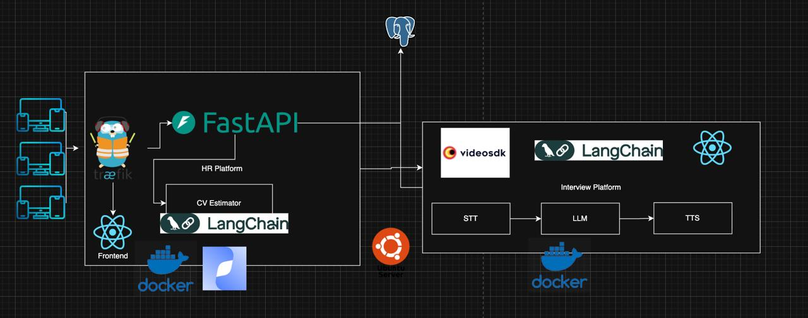

# VTB More Tech 2025

*MISIS x MISIS*

Team Members:

1. **Дмитрий Коноплянников** - Backend, DevOps
2. **Виктория Гайлитис** - Backend
3. **Дарья Короленко** - Design
4. **Ильдар Ишбулатов** - Frontend
5. **Кирилл Рыжичкин** - ML Engineer

Презентация: [тык]()

Веб-сервис: [тык]()

API - [тык]()

## Кейс AI HR

Цель данного кейса — реализовать собственного HR-аватара, который будет иметь следующий функционал, разделенный на этапы:

1. Анализ резюме и отбор кандидатов в соответствии с требованиями вакансии.
2. Проведение структурированных интервью с динамической адаптацией вопросов.
3. Количественное оценивание соответствия кандидата требованиям вакансии.
4. Генерация обоснованных решений с прозрачной логикой отбора.

## Блок-схема всего решения:

## Проблема

- HR в среднем тратят от 4 до 16 часов на ручной скрининг резюме для одной вакансии
- 78% кандидатов не получают обратной связи после интервью, из-за чего они остаются в неведении по поводу своих сильных и слабых сторон
- Низкая эффективность найма обходится бизнесу в миллионы

## AI чать

### Резюме:
- Оценка по критериям (0–100)
- Feedback → сильные/слабые стороны

### Собеседование:
- STT (распознавание речи)
- TTS (озвучка вопросов)
- Чатбот, который адаптируется под вакансию и резюме
- Саммари, strengths/weaknesses
- Verdict: отказ / требуется дополнительное рассмотрение рекрутером / проход на следующий этап

### Стек:

- Backend: Python, Postgress, FastApi
- Frontend: React, Zustand, Tailwind
- ML: Python, transformers, langchain
- DevOps: Docker, nginx

### Наши особенности

- Использование open source решений
- Комплексное решение с собственной HR платформой
- Возможность кастомизации используемых STT, TTS и LLM моделей
- Мультиязычность
- Возможность загрузки файлов нескольких форматов

## Сборка

### Локалькая сборка:

1. Установить postgresql, docker
2. Открыть docker desktop
3. Заполнить все необходимые поля в .env, их нужно создавать по шаблону .env.sample и в том же месте, где находится этот файл
4. В терминале написать docker-compose up --build -d

### Сборка на сервере:

1. На сервер установить и настроить nodeJS, npx, nginx, postgresql, docker, git
2. С помощью git клонируем нашу репозиторию
3. Заполнить все необходимые поля в .env, их нужно создавать по шаблону .env.sample и в том же месте, где находится этот файл
4. И запускаем наш docker compose up --build -d

