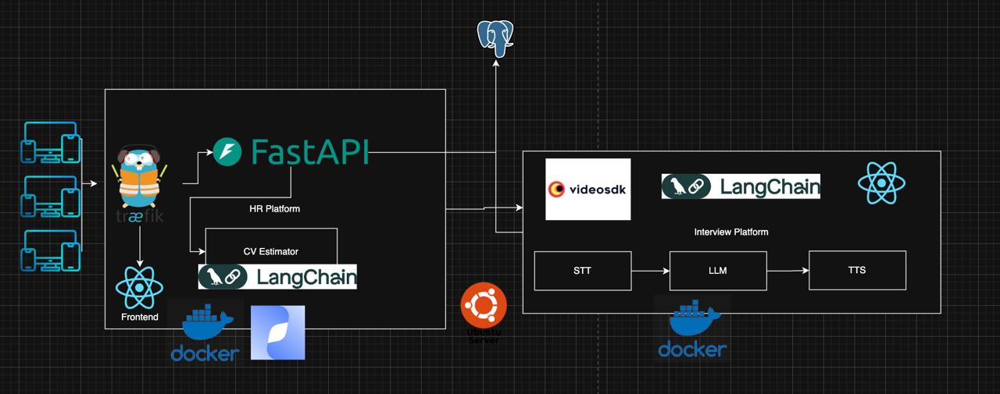

# AI HR Assistant — [VTB MORE.Tech 2025](https://moretech.vtb.ru/) (1st Place, ~$3,500 prize)

**AI-powered hiring platform** that automates resume screening, conducts adaptive voice interviews, and generates structured candidate evaluations. Built during the VTB MORE.Tech hackathon (1,900 participants, 450 teams).

📰 **Press:** [Official VTB MORE.Tech Recap on Habr](https://habr.com/ru/companies/vtb/news/951020/)

---

*MISIS x MISIS*

Team Members:

1. **Dmitry Konoplyannikov** — Backend, DevOps
2. **Victoria Gailitis** — Backend
3. **Darya Korolenko** — Design
4. **Ildar Ishbulatov** — Frontend
5. **Kirill Ryzhichkin** — ML Engineer

## AI HR Challenge

The goal was to build an AI-powered HR avatar with the following capabilities:

1. Resume analysis and candidate screening based on job requirements.
2. Structured interviews with dynamic question adaptation.
3. Quantitative scoring of candidate-to-role fit.
4. Generating reasoned hiring decisions with transparent selection logic.

## Architecture:

## The Problem

- HR teams spend 4–16 hours on average manually screening resumes for a single role
- 78% of candidates never receive feedback after interviews, leaving them unaware of their strengths and weaknesses
- Inefficient hiring costs businesses millions annually

## AI Features

### Resume:
- Criteria-based scoring (0–100)
- Feedback → strengths / weaknesses

### Interview:
- STT (speech-to-text recognition)
- TTS (question voiceover)
- Chatbot that adapts to the job description and resume
- Summary with strengths / weaknesses
- Verdict: reject / needs additional recruiter review / advance to next stage

### Tech Stack:

- Backend: Python, PostgreSQL, FastAPI
- Frontend: React, Zustand, Tailwind
- ML: Python, Transformers, LangChain
- DevOps: Docker, Nginx

### Key Differentiators

- Fully open-source stack — no vendor lock-in
- Complete HR platform, not just a chatbot
- Customizable STT, TTS, and LLM models
- Multilingual support
- Multiple file format uploads

## Run Locally

### Local setup:

1. Install PostgreSQL and Docker
2. Open Docker Desktop
3. Copy `.env.sample` to `.env` and fill in the required values
4. Run `docker-compose up --build -d`

### Server setup:

1. Install and configure Node.js, npx, Nginx, PostgreSQL, Docker, and Git on the server
2. Clone the repository
3. Copy `.env.sample` to `.env` and fill in the required values
4. Run `docker-compose up --build -d`
